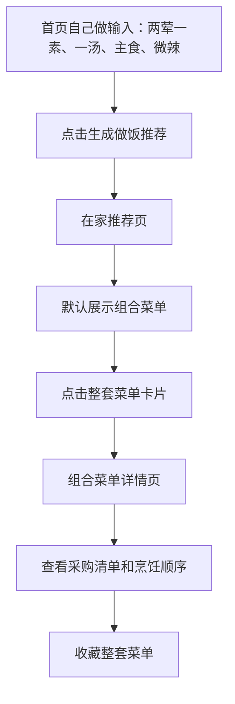
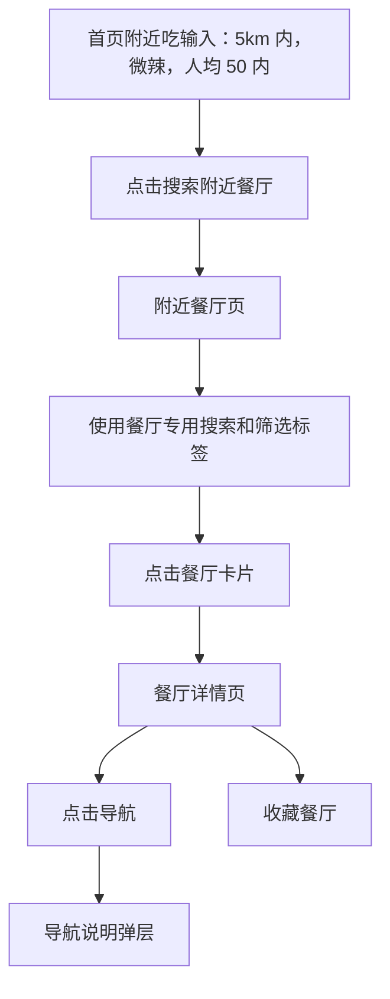
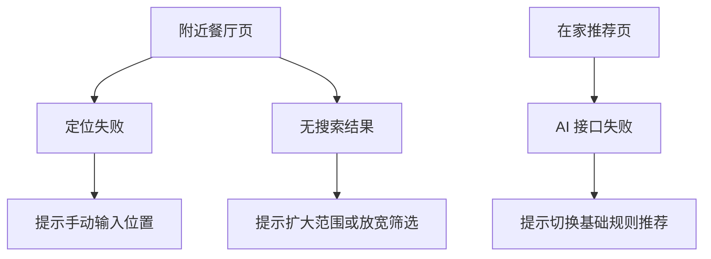

# 吃点啥线稿与交互说明

## 1. 产物说明

本说明基于《吃点啥 Android MVP 项目需求文件》整理，配套本地交互原型：

- 原型文件：`prototype/吃点啥-交互原型.html`
- 目标设备：移动端 Android，默认按 390px 宽手机视口设计
- 原型性质：前端静态交互原型，使用 mock 数据，不接真实 AI、地图、定位或数据库
- 视觉方向：温暖美食风，保留线稿的信息架构表达，同时加入真实感美食图用于评审

## 2. 页面清单

| 页面 | 主要用途 | 入口 | 主要出口 |
| --- | --- | --- | --- |
| 首页 | 分别输入“自己做”和“附近吃”需求 | 打开应用、底部首页 | 在家推荐页、附近餐厅页、设置页 |
| 在家推荐页 | 展示组合菜单和单道菜两类做饭推荐 | 首页自己做输入、生成晚餐组合 | 组合菜单详情页、菜谱详情页 |
| 组合菜单详情页 | 查看一整套晚餐搭配、采购清单和烹饪顺序 | 组合菜单卡片、收藏、历史 | 返回上一页、收藏、查看单道菜 |
| 菜谱详情页 | 查看图文做法、食材、步骤和技巧 | 推荐菜谱卡片、收藏、历史 | 返回上一页、收藏 |
| 附近餐厅页 | 使用独立餐厅搜索，基于位置、距离和口味推荐餐厅 | 首页附近吃输入、底部附近 | 餐厅详情页、无结果状态 |
| 餐厅详情页 | 查看地址、距离、评分、营业状态和导航入口 | 餐厅卡片、收藏、历史 | 返回上一页、导航弹层、收藏 |
| 收藏页 | 查看收藏的组合菜单、菜谱和餐厅 | 底部收藏 | 组合菜单详情页、菜谱详情页、餐厅详情页 |
| 历史页 | 查看最近浏览记录 | 原型内状态入口 | 组合菜单详情页、菜谱详情页、餐厅详情页 |
| 设置页 | 设置口味、忌口、默认半径等个人偏好 | 首页设置、底部设置 | 返回首页、保存反馈 |

## 3. 核心用户流程

### 3.1 输入需求到组合菜单

### 3.2 附近餐厅推荐

### 3.3 异常状态

## 4. 页面线稿说明

### 4.1 首页

首页采用“品牌标题 + 今日推荐图 + 自己做搜索 + 附近吃搜索 + 两个快捷入口 + 今日灵感”的结构。

关键元素：

- 顶部展示产品名“吃点啥”和一句轻量说明。
- 大图区域提供当天饮食氛围和快速推荐入口。
- 自己做搜索框支持“两荤一素、一汤、主食、微辣”等组合菜单需求。
- 附近吃搜索框只处理餐厅搜索，例如距离、口味、预算、营业状态。
- 两组快捷标签分别服务做饭和餐厅，不共用搜索上下文。
- 两个大入口分别指向“生成晚餐组合”和“查看附近餐厅”。
- 今日灵感展示一套组合菜单和一个餐厅，帮助用户在没有输入时快速开始。

### 4.2 在家推荐页

在家推荐页用于体现做饭需求拆解和推荐结果，不再混入附近餐厅搜索。

关键元素：

- 顶部返回、标题、重新推荐。
- AI 摘要卡片展示系统理解到的做饭需求。
- 标签展示菜数、荤素、汤、主食、口味等结构化条件。
- 分段控件切换“组合菜单”和“单道菜”。
- 组合菜单卡片展示整套餐单结构、推荐理由和收藏入口。
- 单道菜卡片展示图片、名称、标签、推荐理由和收藏入口。

### 4.3 组合菜单详情页

组合菜单详情页重点服务“按一桌饭来准备”。

关键元素：

- 顶部返回和收藏。
- 整套菜单主图、名称和结构标签。
- 推荐搭配理由。
- 菜品结构，例如荤菜、素菜、汤、主食。
- 统一采购清单。
- 建议烹饪顺序。
- 查看其中一道详细做法的入口。

### 4.4 菜谱详情页

菜谱详情页重点服务“照着做”。

关键元素：

- 顶部返回和收藏。
- 成品图作为主视觉。
- 菜名、耗时、难度和标签。
- 推荐理由。
- 食材和调料清单。
- 步骤列表。
- 小技巧和注意事项。

### 4.5 附近餐厅页

附近餐厅页重点服务“快速决定去哪吃”。

关键元素：

- 顶部返回、标题和定位按钮。
- 餐厅专用搜索框，独立于自己做模块。
- 位置栏展示当前位置。
- 筛选标签展示默认 5km、营业中、菜系、人均预算等。
- 餐厅卡片展示图片、名称、距离、评分、标签、推荐理由和收藏入口。
- 页面底部提供无结果状态演示入口。

### 4.6 餐厅详情页

餐厅详情页重点服务“确认并出发”。

关键元素：

- 顶部返回和收藏。
- 餐厅图片、名称和标签。
- 距离、评分、预算、营业状态。
- AI 推荐理由。
- 地址和电话。
- 导航按钮。

### 4.7 收藏、历史与设置

收藏页聚合组合菜单、菜谱与餐厅，支持分类查看。

历史页展示最近浏览记录，后续可用于个性化推荐。

设置页包含：

- 常用口味。
- 忌口。
- 默认搜索半径。
- 快手菜优先。
- 只看营业中餐厅。

## 5. 交互规则

### 5.1 导航

- 底部导航包含首页、附近、收藏、设置。
- 首页和附近是高频主入口。
- 历史页在原型中作为辅助状态页保留，可后续放入“我的”或首页入口。
- 详情页使用顶部返回回到上一页。

### 5.2 推荐

- 首页自己做输入框点击生成推荐后进入在家推荐页。
- 在家推荐页默认展示组合菜单。
- 用户可切换到单道菜推荐。
- 附近吃搜索独立进入附近餐厅页，不通过在家推荐页。
- 点击重新推荐会在组合菜单和单道菜之间切换，用于演示结果刷新反馈。

### 5.3 收藏

- 组合菜单、菜谱和餐厅卡片均可收藏。
- 收藏后按钮变为已收藏，并出现 toast 反馈。
- 收藏页会同步展示当前收藏数据。
- 原型收藏数据仅在当前页面会话内有效，正式版本应保存到本地存储。

### 5.4 筛选

- 标签可点击切换选中状态。
- 设置页的默认半径只能单选。
- 附近餐厅页的标签用于表达筛选交互，当前原型不做真实筛选计算。

### 5.5 异常状态

- 定位失败：通过定位按钮触发弹层，提示可手动输入位置。
- AI 失败：在历史页右上角触发弹层，说明正式版本会降级到基础规则推荐。
- 无餐厅结果：在附近餐厅页底部触发无结果卡片，支持放宽条件恢复列表。
- 导航：餐厅详情页触发导航说明弹层，表示正式版本会跳转系统地图。

## 6. Mock 数据说明

组合菜单数据包含：

- 微辣两荤一素一汤晚餐。
- 清淡快手一人晚餐。

菜谱数据包含：

- 番茄肥牛汤。
- 青椒鸡丁。
- 酸辣土豆丝。

餐厅数据包含：

- 巷口牛肉面。
- 小灶湘味馆。
- 明炉烧味茶餐厅。

这些数据用于演示结构和交互，不代表真实餐厅或真实菜谱数据库。

## 7. 开发交接建议

### 7.1 Android 页面拆分

建议拆成以下页面或 Compose Screen：

- HomeScreen
- RecommendationScreen
- MealPlanDetailScreen
- RecipeDetailScreen
- NearbyRestaurantScreen
- RestaurantDetailScreen
- SavedScreen
- SettingsScreen

### 7.2 状态管理

建议至少包含以下状态：

- 当前输入需求。
- 当前做饭搜索需求。
- 当前附近餐厅搜索需求。
- AI 解析结果。
- 推荐列表。
- 定位状态。
- 餐厅 POI 结果。
- 收藏列表。
- 浏览历史。
- 用户偏好。

### 7.3 数据接口

正式开发时建议把原型中的 mock 数据替换为：

- 本地菜谱库或菜谱 API。
- AI 大模型接口。
- 地图开放平台 POI 搜索接口。
- 本地 Room/DataStore 存储。

### 7.4 验收重点

- 首页两个独立搜索入口是否清楚。
- “两荤一素、一汤、主食、微辣”是否能生成整套菜单。
- 用户是否能一眼区分“自己做”和“附近吃”。
- 菜谱详情是否足够支持照着做。
- 餐厅详情是否足够支持决定并导航。
- 异常状态是否清楚，且不出现 AI 编造餐厅的问题。
